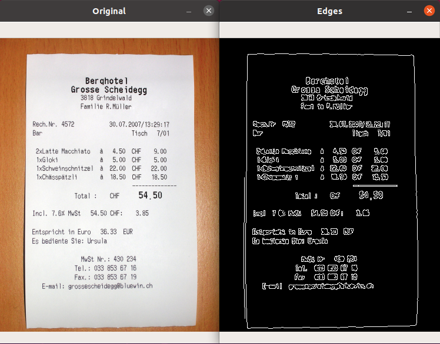
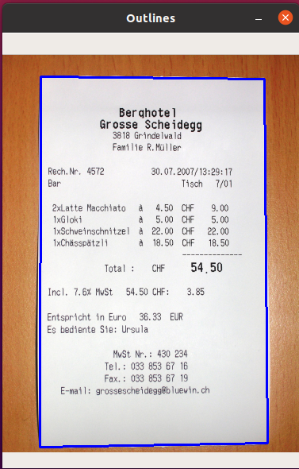

# Mobile Document Scanner with Python and OpenCV
So, I finally completed my first CV project : A Mobile Document Scanner 
## How do I Scan my Documents?
Easy, just fork this repo into your local machine and then type the following command in the repo directory :
<pre>
<code>
python3 scan.py --image "your-image-file-name-here"
</code>
</pre>

## Okay, but how does it works?
The program converts the document image into a scanned file in three steps :  
<ol>
  <li><b>Edge Detection</b></li> 

You can see the original image on the left and the edge detected image on the right.

  <li><b>Contour Drawing</b></li> 

See that blue rectangular border around the receipt? That's what a drawn contour is.

  <li><b>Perspective Transformation</b></li> 

And Voila!, just how we wanted the scanned receipt.

